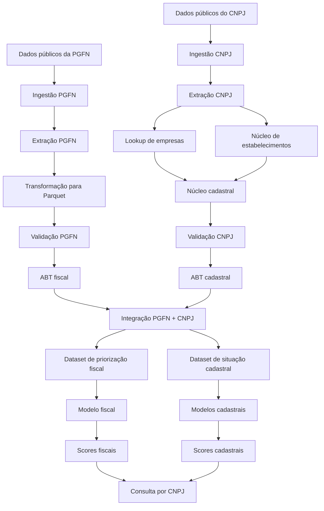

<div align="center">

# Radar Empresarial

### Inteligência fiscal e cadastral com dados públicos

Da ingestão das fontes públicas à consulta analítica e explicável por CNPJ.


</div>

<p align="center">
  
</p>

---

## Visão geral

Este projeto constrói um pipeline reprodutível para integrar duas grandes
fontes de dados públicos brasileiros:

- dados da Dívida Ativa da União disponibilizados pela **Procuradoria-Geral
  da Fazenda Nacional — PGFN**;
- dados cadastrais de empresas e estabelecimentos disponibilizados pela
  **Receita Federal do Brasil**.

O resultado é uma base analítica integrada por raiz do CNPJ, utilizada na
construção de indicadores empresariais, modelos estatísticos explicáveis e
uma interface final de consulta por CNPJ.

O projeto cobre todo o fluxo de dados:

```text
ingestão
   ↓
extração segura
   ↓
tratamento e validação
   ↓
construção das ABTs
   ↓
integração PGFN + CNPJ
   ↓
modelagem
   ↓
scoring e explicabilidade
   ↓
consulta analítica por CNPJ
```

---

## Problema de negócio

Informações fiscais e cadastrais de empresas estão distribuídas em arquivos
públicos extensos, com estruturas, períodos e granularidades diferentes.

A consulta direta dessas fontes exige:

- download de diversos arquivos;
- tratamento de grandes volumes de dados;
- padronização de CNPJs e datas;
- consolidação de informações fiscais;
- agregação de estabelecimentos por empresa;
- controle da cardinalidade dos relacionamentos;
- interpretação conjunta de informações fiscais e cadastrais.

O projeto organiza essas informações para apoiar dois produtos analíticos:

1. **priorização fiscal de empresas**;
2. **classificação da situação cadastral observada**.

A unidade principal de análise é a **raiz do CNPJ**, formada pelos oito
primeiros dígitos do identificador completo.

---

## Objetivo

Desenvolver uma solução ponta a ponta capaz de:

- coletar dados públicos da PGFN e do CNPJ;
- processar grandes arquivos de forma eficiente;
- organizar os dados em formato analítico;
- validar esquemas, chaves e domínios;
- integrar informações fiscais e cadastrais;
- construir indicadores por empresa;
- treinar modelos estatísticos;
- gerar scores explicáveis;
- disponibilizar uma consulta consolidada por CNPJ.

---

## Principais entregas

| Entrega | Descrição |
|---|---|
| Pipeline de ingestão | Download controlado das fontes públicas da PGFN e do CNPJ |
| Extração segura | Validação dos caminhos internos e extração atômica de arquivos ZIP |
| Processamento em lotes | Tratamento de grandes volumes sem carregamento integral em memória |
| Armazenamento analítico | Conversão das fontes para o formato Parquet |
| Validação estrutural | Verificação de esquemas, chaves, nulos, domínios e compatibilidade |
| Construção de ABTs | Agregações fiscais e cadastrais por raiz do CNPJ |
| Integração das fontes | Relacionamento entre informações da PGFN e da Receita Federal |
| Modelagem explicável | Regressão logística e modelos baseados em árvores |
| Geração de scores | Aplicação dos modelos sobre as bases analíticas |
| Consulta por CNPJ | Scores, indicadores e fatores associados ao resultado |
| Interface unificada | Execução das etapas pelo comando `pgfn-cnpj` |

---

## Fluxo do projeto



---

## Produtos analíticos

### 1. Priorização fiscal

O primeiro produto cria um score para ordenar empresas conforme uma regra
operacional de priorização fiscal.

O alvo é definido como positivo quando a empresa apresenta pelo menos uma
das condições:

- existência de inscrição ajuizada;
- dívida total igual ou superior ao percentil 90 da base analisada.

A construção do dataset utiliza uma lista explícita de preditores e exclui
as variáveis que participam diretamente da definição do alvo ou que
representam derivações imediatas dessas informações.

O modelo principal utiliza **regressão logística regularizada**, permitindo
avaliar:

- a direção da associação de cada variável;
- a magnitude dos coeficientes;
- a contribuição dos fatores para o score;
- a ordenação das empresas segundo a regra de priorização.

> **Interpretação correta:** o resultado classifica uma regra operacional
> construída com informações contemporâneas. Ele não representa previsão
> de inadimplência futura.

---

### 2. Situação cadastral observada

O segundo produto classifica a condição cadastral da empresa no snapshot
da base do CNPJ.

O alvo é definido como:

```text
y_descontinuidade = 1  → empresa sem estabelecimento ativo
y_descontinuidade = 0  → empresa com pelo menos um estabelecimento ativo
```

As variáveis diretamente ligadas à definição desse alvo são mantidas para
auditoria e apresentação dos indicadores, mas são excluídas do treinamento:

```text
qtd_ativos
qtd_inativos
pct_ativos
```

A etapa compara modelos como:

- regressão logística;
- Random Forest.

A análise permite identificar padrões associados à condição cadastral
observada, considerando características como:

- idade da empresa;
- porte empresarial;
- quantidade de estabelecimentos;
- distribuição geográfica;
- tempo desde alterações cadastrais;
- características da atividade econômica.

> **Interpretação correta:** o score representa a condição cadastral
> observada no snapshot. Ele não deve ser interpretado isoladamente como
> previsão de encerramento futuro da empresa.

---

## Produto final

O produto final é uma consulta analítica por CNPJ que reúne, em uma única
visão:

- identificação cadastral da empresa;
- indicadores fiscais;
- indicadores cadastrais;
- score de priorização fiscal;
- score de situação cadastral;
- classificação correspondente;
- principais fatores associados aos resultados;
- limitações metodológicas de cada análise.

A saída final não apresenta apenas uma probabilidade. Ela combina o score,
a classificação, os indicadores observados, os fatores associados ao
resultado e a interpretação adequada de cada produto analítico.

---

## Exemplo de saída do produto final

> **Observação:** o exemplo abaixo é meramente ilustrativo. Os valores, o
> CNPJ e a razão social foram criados apenas para demonstrar o formato da
> saída produzida pelo projeto.

```text
============================================================
CONSULTA ANALÍTICA POR CNPJ
============================================================

CNPJ consultado: 12.345.678/0001-95
Raiz do CNPJ:    12345678
Razão social:    EMPRESA DEMONSTRATIVA LTDA
UF:              RS
CNAE principal:  6201501
Porte:           DEMAIS

------------------------------------------------------------
1. PRIORIZAÇÃO FISCAL
------------------------------------------------------------

Score de priorização: 0,82
Faixa de prioridade:  ALTA
Posição relativa:     percentil 91

Condição observada na base:
- Dívida total: R$ 1.840.000,00
- Quantidade de inscrições: 14
- Inscrições ajuizadas: 3
- Percentual ajuizado: 21,4%
- Tempo médio das inscrições: 6,8 anos

Principais fatores associados ao score:
1. Maior quantidade de inscrições fiscais
2. Presença de inscrições ajuizadas
3. Maior tempo médio das inscrições
4. Concentração elevada do valor da dívida
5. Diversidade de receitas principais

Interpretação:
A empresa apresenta características contemporâneas associadas à regra de
priorização fiscal utilizada pelo projeto. O resultado não representa uma
previsão de inadimplência futura.

------------------------------------------------------------
2. SITUAÇÃO CADASTRAL OBSERVADA
------------------------------------------------------------

Score de descontinuidade cadastral: 0,74
Classificação do modelo:            SEM ATIVIDADE OBSERVADA
Situação registrada no snapshot:    sem estabelecimento ativo

Indicadores cadastrais:
- Estabelecimentos totais: 4
- Estabelecimentos ativos: 0
- Estabelecimentos inativos: 4
- Idade estimada da empresa: 18,7 anos
- Tempo desde a última situação cadastral: 3,2 anos

Principais fatores associados ao resultado:
1. Tempo desde a alteração cadastral
2. Idade da empresa
3. Quantidade total de estabelecimentos
4. Porte empresarial
5. Distribuição geográfica dos estabelecimentos

Interpretação:
O resultado classifica a condição cadastral observada no snapshot analisado.
Ele não constitui, isoladamente, uma previsão de encerramento futuro.

------------------------------------------------------------
SÍNTESE
------------------------------------------------------------

Prioridade fiscal:       ALTA
Condição cadastral:      SEM ATIVIDADE OBSERVADA
Consulta concluída:      resultados disponíveis para apoio à análise

Os scores devem ser utilizados como instrumentos de priorização e apoio à
decisão, não como substitutos da análise fiscal, jurídica, cadastral ou
comercial especializada.
```

Essa visão permite identificar rapidamente:

- quem é a empresa consultada;
- qual é o nível de prioridade fiscal;
- qual condição cadastral foi observada;
- quais indicadores sustentam a análise;
- quais fatores contribuíram para os scores;
- quais são os limites de interpretação dos resultados.

---

## Fontes de dados

### PGFN

Dados públicos relacionados à Dívida Ativa da União, organizados por:

- ano;
- trimestre;
- unidade federativa;
- situação da inscrição;
- tipo de dívida;
- devedor;
- valor consolidado;
- indicador de ajuizamento.

Recorte principal utilizado pelo projeto:

```text
2024–2025
```

---

### Receita Federal — CNPJ

Dados públicos cadastrais de empresas e estabelecimentos.

Entre as informações utilizadas estão:

- razão social;
- porte empresarial;
- situação cadastral;
- data da situação cadastral;
- data de início da atividade;
- CNAE principal;
- unidade federativa;
- município;
- quantidade de estabelecimentos.

Snapshot utilizado pelo pipeline atual:

```text
2025-12
```

Os endereços das fontes são controlados por arquivos de configuração:

```text
config/
├── pgfn_periodos.csv
└── cnpj_arquivos.csv
```

---

## Arquitetura do repositório

```text
radar-empresarial/
│
├── config/
│   ├── pgfn_periodos.csv
│   └── cnpj_arquivos.csv
│
├── data/
│   ├── raw/
│   ├── staging/
│   └── processed/
│
├── docs/
│   ├── dicionario_abt_completa.md
│   ├── dicionario_modelo1.md
│   └── dicionario_modelo2.md
│
├── models/
│
├── notebooks/
│
├── reports/
│
├── src/
│   └── pgfn_cnpj/
│       │
│       ├── cli/
│       │   ├── __init__.py
│       │   ├── main.py
│       │   └── query_cnpj.py
│       │
│       ├── ingestion/
│       │   ├── __init__.py
│       │   ├── archive.py
│       │   ├── cnpj.py
│       │   ├── extract_cnpj.py
│       │   ├── extract_pgfn.py
│       │   ├── http.py
│       │   └── pgfn.py
│       │
│       ├── modeling/
│       │   ├── __init__.py
│       │   │
│       │   ├── business_discontinuity/
│       │   │   ├── __init__.py
│       │   │   ├── build_dataset.py
│       │   │   ├── score_models.py
│       │   │   └── train_models.py
│       │   │
│       │   └── fiscal_risk/
│       │       ├── __init__.py
│       │       ├── build_dataset.py
│       │       ├── score_explain.py
│       │       └── train_logistic.py
│       │
│       ├── pipeline/
│       │   ├── __init__.py
│       │   ├── build_cnpj_abt.py
│       │   ├── build_cnpj_core.py
│       │   ├── build_empresas_lookup.py
│       │   ├── build_estabelecimentos_core.py
│       │   ├── build_pgfn_abt.py
│       │   ├── join_pgfn_cnpj.py
│       │   └── transform_pgfn.py
│       │
│       ├── validation/
│       │   ├── __init__.py
│       │   ├── common.py
│       │   ├── validate_cnpj.py
│       │   └── validate_pgfn.py
│       │
│       ├── __init__.py
│       └── settings.py
│
├── .gitignore
├── pyproject.toml
├── requirements.txt
└── README.md
```

As bases brutas, arquivos processados, modelos treinados e demais artefatos
de grande volume são gerados localmente e não são versionados no Git.

---

## Tecnologias utilizadas

- **Python**
- **Pandas**
- **PyArrow**
- **DuckDB**
- **Apache Parquet**
- **scikit-learn**
- **Joblib**
- **Requests**
- **Git**
- **GitHub**
- **GitHub Codespaces**

### Papel das principais tecnologias

| Tecnologia | Aplicação no projeto |
|---|---|
| Pandas | Limpeza, transformação, amostragem e relatórios |
| PyArrow | Escrita e leitura eficiente de arquivos Parquet |
| DuckDB | Agregações e relacionamentos em grandes arquivos |
| scikit-learn | Pré-processamento, treinamento e avaliação dos modelos |
| Joblib | Persistência dos modelos treinados |
| Requests | Download controlado das fontes públicas |
| Parquet | Armazenamento colunar das bases processadas |

---

## Instalação

Clone o repositório:

```bash
git clone https://github.com/GJFR71/radar-empresarial.git
cd radar-empresarial
```

Crie e ative um ambiente virtual.

### Linux ou macOS

```bash
python -m venv .venv
source .venv/bin/activate
```

### Windows PowerShell

```powershell
python -m venv .venv
.venv\Scripts\Activate.ps1
```

Atualize o instalador de pacotes:

```bash
python -m pip install --upgrade pip
```

Instale o projeto em modo editável:

```bash
python -m pip install --editable .
```

Para instalar também as dependências de desenvolvimento:

```bash
python -m pip install --editable ".[dev]"
```

Confirme a instalação:

```bash
pgfn-cnpj --version
pgfn-cnpj --help
```

---

## Interface de linha de comando

Todas as etapas podem ser acessadas por uma única interface:

```bash
pgfn-cnpj <comando> [opções]
```

Para consultar todos os comandos:

```bash
pgfn-cnpj --help
```

Para consultar os parâmetros de uma etapa específica:

```bash
pgfn-cnpj transform-pgfn --help
```

---

## Comandos disponíveis

### Ingestão e extração

```text
ingest-pgfn
ingest-cnpj
extract-pgfn
extract-cnpj
```

### Construção das bases

```text
transform-pgfn
build-empresas-lookup
build-estabelecimentos-core
build-cnpj-core
build-pgfn-abt
build-cnpj-abt
join-abts
```

### Validação

```text
validate-pgfn
validate-cnpj
```

### Modelagem

```text
build-fiscal-risk-dataset
train-fiscal-risk
score-fiscal-risk

build-discontinuity-dataset
train-discontinuity
score-discontinuity
```

### Consulta

```text
query-cnpj
```

---

## Execução do pipeline

### 1. Ingestão da PGFN

```bash
pgfn-cnpj ingest-pgfn
```

É possível selecionar o intervalo de anos:

```bash
pgfn-cnpj ingest-pgfn \
  --start-year 2024 \
  --end-year 2025
```

---

### 2. Ingestão do CNPJ

```bash
pgfn-cnpj ingest-cnpj
```

Também é possível selecionar grupos específicos:

```bash
pgfn-cnpj ingest-cnpj \
  --groups empresas
```

```bash
pgfn-cnpj ingest-cnpj \
  --groups estabelecimentos
```

---

### 3. Extração da PGFN

```bash
pgfn-cnpj extract-pgfn
```

---

### 4. Extração do CNPJ

```bash
pgfn-cnpj extract-cnpj
```

A extração ocorre em subpastas individuais para evitar colisões entre
arquivos e permitir substituição controlada.

---

### 5. Transformação da PGFN

```bash
pgfn-cnpj transform-pgfn
```

Essa etapa:

- localiza os CSVs trimestrais;
- identifica separadores e codificações;
- padroniza os nomes das variáveis;
- converte valores monetários;
- incorpora ano, trimestre e UF;
- grava a base consolidada em Parquet.

---

### 6. Construção do núcleo cadastral

```bash
pgfn-cnpj build-empresas-lookup
```

```bash
pgfn-cnpj build-estabelecimentos-core
```

```bash
pgfn-cnpj build-cnpj-core
```

O relacionamento entre empresas e estabelecimentos é realizado pela raiz
do CNPJ.

---

### 7. Validação das bases

```bash
pgfn-cnpj validate-pgfn
```

```bash
pgfn-cnpj validate-cnpj
```

As validações verificam:

- presença das variáveis esperadas;
- tipos armazenados no Parquet;
- valores ausentes;
- cardinalidade;
- domínios;
- formato dos identificadores;
- consistência entre CNPJ completo e raiz;
- compatibilidade com as etapas seguintes.

---

### 8. Construção das ABTs

```bash
pgfn-cnpj build-pgfn-abt
```

```bash
pgfn-cnpj build-cnpj-abt
```

```bash
pgfn-cnpj join-abts
```

A integração final combina indicadores fiscais e cadastrais por raiz do
CNPJ.

---

## Modelagem

### Priorização fiscal

Construa o dataset:

```bash
pgfn-cnpj build-fiscal-risk-dataset
```

Treine o modelo:

```bash
pgfn-cnpj train-fiscal-risk
```

Gere os scores e explicações:

```bash
pgfn-cnpj score-fiscal-risk
```

---

### Situação cadastral

Construa o dataset:

```bash
pgfn-cnpj build-discontinuity-dataset
```

Treine os modelos:

```bash
pgfn-cnpj train-discontinuity
```

Gere os scores:

```bash
pgfn-cnpj score-discontinuity
```

Os treinamentos utilizam:

- separação entre treino e teste;
- pipelines de pré-processamento;
- tratamento de variáveis numéricas e categóricas;
- controle de sementes;
- métricas adequadas à classificação;
- persistência dos modelos;
- registro dos resultados.

---

## Consulta por CNPJ

Após a construção dos datasets e o treinamento dos modelos, é possível
consultar uma empresa pela raiz do CNPJ ou pelo CNPJ completo.

Exemplo:

```bash
pgfn-cnpj query-cnpj \
  --cnpj 12345678000195 \
  --model both \
  --top-factors 5
```

Para consultar somente o produto fiscal:

```bash
pgfn-cnpj query-cnpj \
  --cnpj 12345678000195 \
  --model fiscal
```

Para consultar somente o produto cadastral:

```bash
pgfn-cnpj query-cnpj \
  --cnpj 12345678000195 \
  --model discontinuity
```

Para salvar o resultado em arquivo de texto:

```bash
pgfn-cnpj query-cnpj \
  --cnpj 12345678000195 \
  --model both \
  --top-factors 5 \
  --save-txt
```

A consulta apresenta:

- identificação da empresa;
- score de cada produto analítico;
- condição observada;
- indicadores relevantes;
- principais fatores associados;
- limitação metodológica correspondente.

---

## Organização dos resultados

Durante a execução, os artefatos são organizados em diretórios específicos:

```text
data/
├── raw/
│   ├── pgfn/
│   └── cnpj/
│
├── staging/
│   ├── pgfn/
│   └── cnpj/
│
└── processed/
    ├── pgfn/
    ├── cnpj/
    ├── abt/
    └── modeling/

models/
├── fiscal_risk/
└── business_discontinuity/

reports/
├── consultations/
├── figures/
├── manifests/
├── metrics/
├── samples/
└── tables/
```

Entre os resultados produzidos estão:

- bases consolidadas em Parquet;
- amostras de inspeção;
- esquemas das bases;
- perfis de valores ausentes;
- tabelas de domínios;
- relatórios de validação;
- métricas dos modelos;
- coeficientes;
- importâncias de variáveis;
- scores;
- explicações individuais;
- consultas por CNPJ.

---

## Processamento de grandes volumes

O projeto foi estruturado para evitar o carregamento integral das bases em
memória.

Entre as estratégias utilizadas estão:

- leitura de CSVs em lotes;
- escrita incremental em Parquet;
- consultas diretamente sobre arquivos com DuckDB;
- seleção de colunas necessárias;
- geração de amostras controladas;
- processamento por períodos e grupos;
- uso de diretório temporário;
- escrita atômica dos resultados.

---

## Validação e qualidade dos dados

As rotinas de validação foram separadas do processamento principal.

Isso permite identificar problemas antes da construção das ABTs e do
treinamento dos modelos.

Entre os controles implementados estão:

- existência dos arquivos;
- volume de registros;
- esquema do Parquet;
- presença das variáveis obrigatórias;
- formato do CNPJ completo;
- formato da raiz do CNPJ;
- correspondência entre CNPJ e raiz;
- valores ausentes;
- variáveis constantes;
- domínios categóricos;
- cardinalidade dos relacionamentos;
- preservação da quantidade de registros após joins;
- taxa de correspondência entre empresas e estabelecimentos.

---

## Cuidados metodológicos

O projeto adota medidas específicas para reduzir erros comuns em pipelines
de dados e modelagem:

- listas explícitas de variáveis utilizadas pelos modelos;
- exclusão de preditores ligados diretamente à definição dos alvos;
- separação entre variáveis de auditoria e variáveis preditoras;
- extração segura de arquivos ZIP;
- escrita atômica dos resultados;
- processamento em lotes;
- validação de esquemas antes das integrações;
- controle da cardinalidade dos joins;
- amostragem determinística;
- controle de sementes nos modelos;
- separação entre dados, modelos, relatórios e código;
- registro dos parâmetros e métricas de cada execução;
- interpretação compatível com a forma de construção dos alvos.

---

## Reprodutibilidade

Os principais parâmetros do pipeline podem ser controlados pela linha de
comando, incluindo:

- período analisado;
- grupos de arquivos;
- tamanho dos lotes;
- quantidade de threads;
- limite de memória;
- tamanho das amostras;
- quantidade de row groups avaliados;
- substituição controlada de resultados.

Consulte as opções disponíveis com:

```bash
pgfn-cnpj <comando> --help
```

---

## Limitações

- Os resultados dependem da qualidade, disponibilidade e atualização das
  fontes públicas.
- A análise fiscal utiliza informações contemporâneas e não constitui uma
  previsão temporal de inadimplência.
- A análise cadastral classifica o estado observado no snapshot e não
  constitui previsão isolada de encerramento futuro.
- A ausência de um CNPJ na base processada impede a consulta.
- Alterações posteriores ao período de referência não estão representadas.
- Os scores não substituem análise fiscal, jurídica, cadastral, comercial
  ou de crédito especializada.
- O projeto utiliza dados agregados e não pretende reproduzir processos
  oficiais de decisão da Administração Pública.


---

## Documentação

- [Dicionário da ABT integrada](docs/dicionario_abt_completa.md)
- [Dicionário da análise de priorização fiscal](docs/dicionario_modelo1.md)
- [Dicionário da análise de situação cadastral](docs/dicionario_modelo2.md)

---

## Autor

**Glaucio Rosa**

Estatístico com experiência em análise de dados, Business Intelligence,
Inteligência Artificial, gestão de projetos e desenvolvimento de soluções
analíticas orientadas à decisão.


---

## Aviso de uso

Os dados utilizados são provenientes de fontes públicas.


Scores e classificações representam relações estatísticas observadas nos
dados processados e não garantem acontecimentos futuros.

O uso dos resultados deve considerar:

- o período de referência;
- a atualização das fontes;
- as limitações metodológicas;
- o contexto específico da decisão;
- a necessidade de análise especializada.
